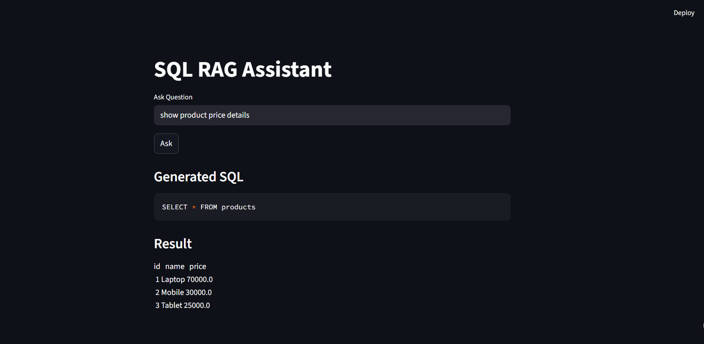

# SQL RAG Assistant


## 🌟 Overview
**SQL RAG Assistant** is an **AI-powered interactive tool** that lets you query SQL databases using **natural language**.  

It uses:  
- **RAG (Retrieval-Augmented Generation)** for accurate query understanding  
- **Context-aware memory** for follow-up queries  
- **Automatic chart generation** for visual insights  

Perfect for **data analysts, developers, and AI enthusiasts** who want SQL insights without writing complex queries.

---

## 🔹 Key Features
- Natural language SQL queries  
- Multi-table support  
- Context-aware memory for follow-ups  
- Auto-generated charts (bar, line, pie, etc.)  
- Compatible with MySQL, PostgreSQL, SQLite  
- Streamlit frontend for interactive querying  

---

## 📂 Project Structure

```text
sql-rag-assistant/
│
├── backend/
│   ├── app.py               # Backend server
│   ├── rag_sql_agent.py     # RAG SQL logic
│   ├── db_setup.py          # Database connection & setup
│   ├── prompt_template.py   # SQL prompt templates
│   ├── requirements.txt     # Python dependencies
│   └── config.py            # Database configuration
│
├── database/
│   └── sales.sql            # Sample database schema & data
│
└── frontend/
    └── streamlit_app.py     # Streamlit frontend interface

```
## 📸 Screenshots / Demo

**Frontend Interface:**  


---
🚀 Usage
Start Backend
python backend/app.py
Launch Frontend
streamlit run frontend/streamlit_app.py
Example Queries
"Show total sales per month"
"List top 10 customers by revenue"
"Generate a bar chart for product category sales"

---

## 👤 Author

**Shubham Raut**  
-  Data Scientist/Machine Learning


